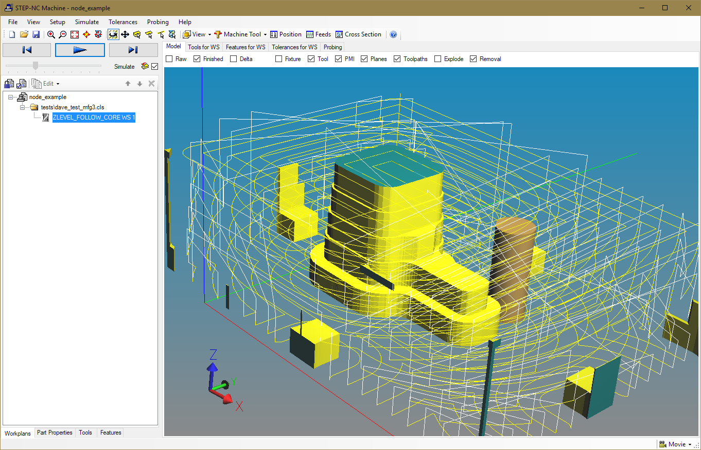
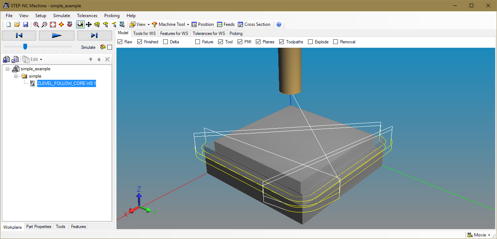
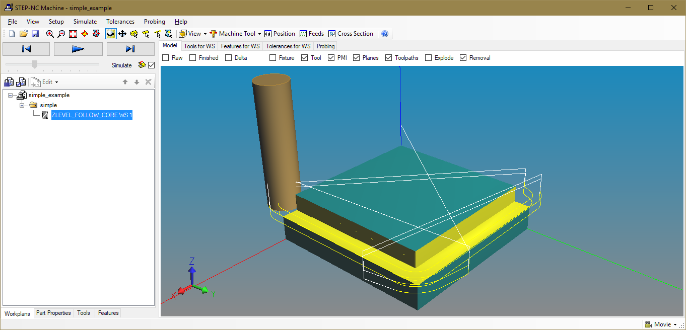
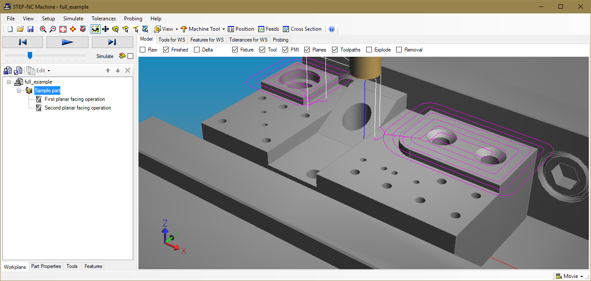
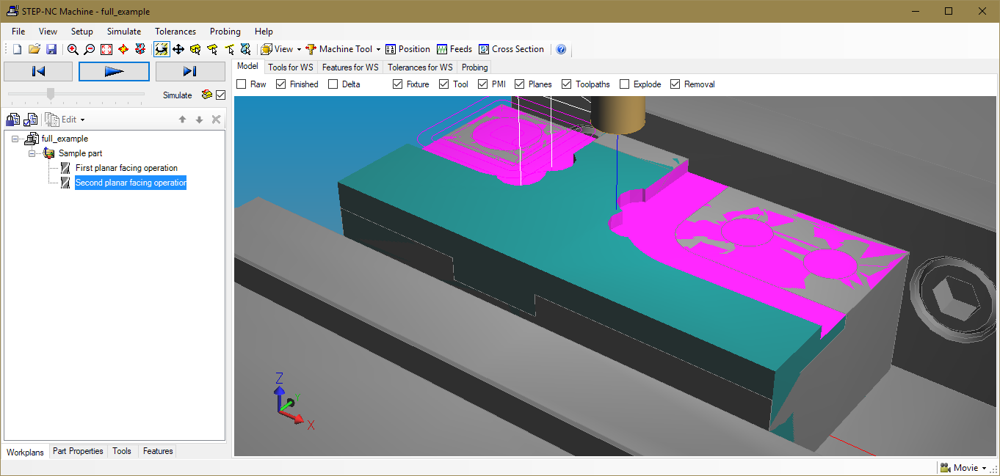

# Import NX Data and Build Models

The files in this directory demonstrate how to import CAM data from
Siemens NX and build complete digital thread models using STEPNode.


## NX Import

The NX translator reads CLS files produced by Siemens NX CAM and
converts them to STEP-NC models for use on the digital thread.  This
translator program can be customized as desired to enhance it with
your own semantics or to integrate data from other sources, like CAD
models for your tools, raw stock, or final workpiece.  

Run the program with node and give the CLS data as a command line
argument.  It will process the file and save it in your current
directory with the "_thread.stpnc" ending.

For example, we can import the NX CAM process shown below. 

```
>node nximport.js "data/coremill.cls"
```


This will produce a `coremill_thread.stpnc` file containing the path
data and a simple tool definition.  We can read this into the STEP-NC
desktop tool and simulate it if we add a rawpiece definition.  Here we
simply box the toolpaths by right clicking on the main workplan and
selecting "Rawpiece | Create Initial (As-Is) Shape ..." then select
the "Toolpath" envelope.   After simulation we get the following:




## Assemble Thread Model from NX

The `buildsimple.js` program shows how we can extend the translator to
add in CAD models.  We call the translator code and then attach the
as-is and to-be CAD models.  We have placed the translator code in the
`ParseNX.js` node module for easy reuse.

```
apt.NewProject("simple");
apt.Millimeters();   // default to millimeters

// Read CAM process
ImportPaths("data/simple_block.cls");

// Read workpiece and rawpiece geometry as STEP
apt.Workpiece("data/simple_block_workpiece.stp");
apt.Rawpiece("data/simple_block_rawpiece.stp");
apt.SaveAsModules("simple_example");
```


With the CAD model for the stock, there is enough information to
immediately simulate the process, which produces the following:




## Assemble More Complex Thread Model

The `buildfull.js` program shows a more complex example, which defines
tools, brings in CAM process from several files, adds a CAD model for
the final shape, generates a box model for the starting shape, and
defines a fixture model.

```
apt.PartNo("Sample part");

// Define a tool
apt.Millimeters();
apt.CamModeOn();
apt.DefineTool(0.25, 5.0, 1.0, 2.0, 3.0, 4.0, 5.0);

// Read the first program
ImportPaths("data/Plane_1.cldata");

// Define feature and operation
let ws_id = apt.GetCurrentWorkingstep();
pro.PlaneFinishMilling(ws_id, 0, 3);
apt.SetName(ws_id, "First planar facing operation");

// Read the second progra
ImportPaths("data/Plane_2.cldata");

// Define the feature and operation
ws_id = apt.GetCurrentWorkingstep();
pro.PlaneFinishMilling(ws_id, 0, 3);
apt.SetName(ws_id, "Second planar facing operation");

// Read workpiece geometry as STEP
apt.Workpiece("data/hole_model.stp");

// Make geoemtry for Rawpiece
let wp_id = apt.GetCurrentWorkplan ();
apt.MakeRawBox (wp_id, -50, -25, 0, 50, 25, 31);

// Make some geometry for cutter
let tl_id = apt.GetCurrentTool ();
pro.SetToolLength(tl_id, 100);
apt.SetToolIdentifier(apt.GetToolNumber(tl_id), "My Cutting Tool");
apt.GenerateToolGeometry(tl_id);
pro.SetToolOverallAssemblyLength(tl_id, 80);

apt.Fixture("data/vise.stp");
let fixture_id = apt.GetCurrentFixture();
apt.PutWorkpiecePlacement(fixture_id, 0, -25, 41.5, 0, 1, 0, 1, 0, 0);

apt.SaveAsModules("full_example");
```



This digital thread model also has enough information to immediately
simulate the process, which produces the following:



